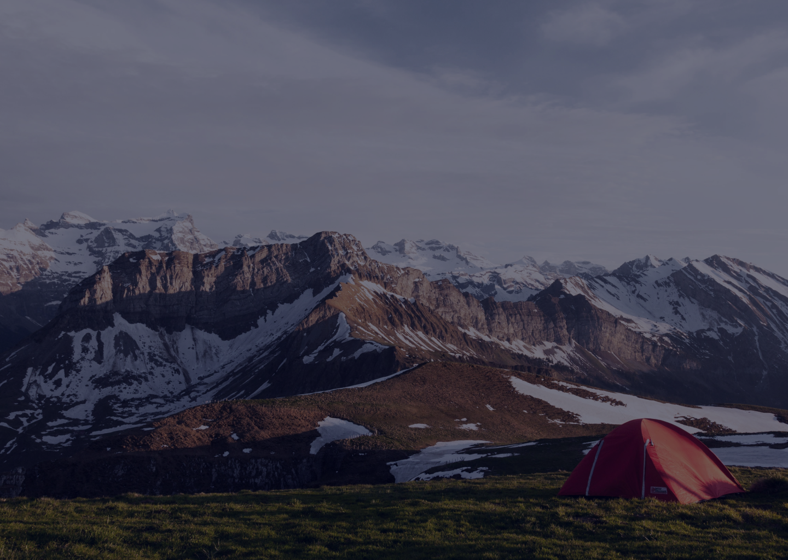

# Adventure
full responsive website
# 🌍 Adventure Landing Page

A responsive and visually appealing **Adventure Landing Page** built using HTML and CSS. This project showcases upcoming events, tour destinations, and a compelling design layout to inspire travel and exploration.

## 📸 Preview

  
*Note: Replace this image with a screenshot of your live project for better visual impact.*

---

## 🚀 Features

- Responsive navigation menu (with mobile toggle)
- Hero section with call-to-action
- Upcoming events section
- Explore section with background image and description
- Tours and destinations gallery
- Styled footer with contact information
- Fully responsive layout for both desktop and mobile views

---

## 🛠️ Tech Stack

- HTML5
- CSS3 (Flexbox, Media Queries)
- Google Fonts (Poppins & Nunito)

---

## 📂 Folder Structure

📁 project-root ├── index.html ├── style.css └── img/ ├── header-bg.png ├── menu-btn.png ├── img1.png ├── img2.png ├── img3.png ├── img4.png ├── img5.png └── img6.png
